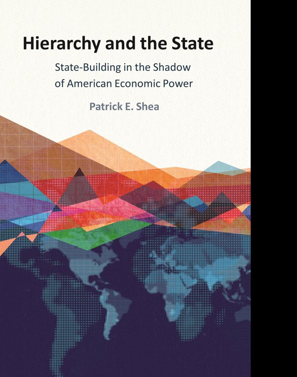

:::: {.columns}

::: {.column width="35%"}
{fig-alt="Cover of Hierarchy and the State by Patrick E. Shea"}
:::

::: {.column width="5%"}
:::

::: {.column width="60%"}
**Patrick E. Shea (2025)**

[Cambridge University Press](https://www.cambridge.org/gb/universitypress/subjects/politics-international-relations/international-relations-and-international-organisations/hierarchy-and-state-state-building-shadow-american-economic-power?format=PB){.btn .btn-primary}  | [Replication Files](https://doi.org/10.7910/DVN/OBK4RI)

:::

::::

---

## About the Book

Does American influence help or hinder capacity-building in partner states? In Hierarchy and the State, I argue that US support has enhanced state capacity over the past forty years, contrary to the conventional view that American influence undermines state-building in developing countries. American economic power has increased a state's ability to build and sustain itself.

The book traces the evolution of US property rights promotion from 1782 to the present, showing how economic and security interests have shaped American foreign policy across this period. I use quantitative analysis and original data on US hierarchy to demonstrate the mechanisms linking international influence, property rights, and state-building outcomes.

The framework changes how scholars examine the international politics of state-building. Instead of treating hierarchy as uniformly extractive, the book shows that the structure of American economic relationships has created conditions for institutional development in partner countries.